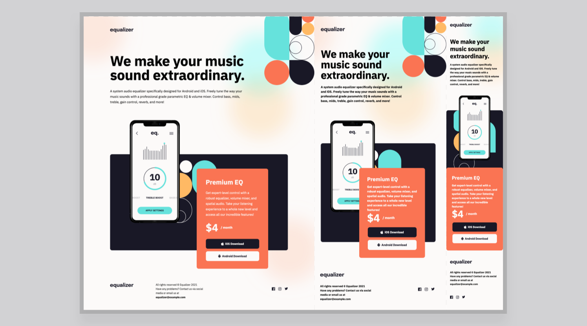

# Equalizer Landing Page

## Table of contents

- [Overview](#overview)
  - [Screenshot](#screenshot)
  - [Live Page](#live-page)
  - [Built with](#built-with)
- [Author](#author)

## Overview

This is a solution to the [Equalizer landing page challenge on Frontend Mentor](https://www.frontendmentor.io/challenges/equalizer-landing-page-7VJ4gp3DE).

### Screenshot

### Live Page

A live version of this repo can be found [here](https://chekhovs-func.github.io/equalizer-landing-page/).

### Built with

- Semantic HTML5 markup
- [Sass](https://sass-lang.com/) - For styles
- Flexbox
- [React](https://reactjs.org/) - JS library
- Mobile-first workflow

## Author

- Github - [Robert Butler](https://github.com/chekhovs-func)
